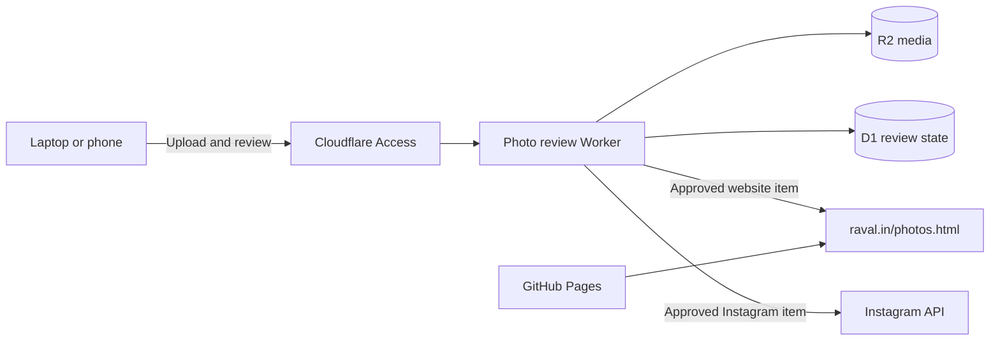

# raval.in

Source for [raval.in](https://raval.in), Ninad Raval's personal website and photo gallery. GitHub Pages publishes the `master` branch, while Cloudflare hosts the private photo review and publishing service.

## Photo publishing

The recommended workflow runs entirely in the browser:

1. Open the [private photo review desk](https://ninad-photo-review.ninad-085.workers.dev/).
2. Sign in through Cloudflare Access as `ninad@raval.in`.
3. Upload a JPEG, PNG, WebP, or MP4 file under 95 MB.
4. Choose the Instagram format, adjust the crop, and edit the caption and visual description.
5. Save as often as needed. The media remains a private draft.
6. Approve the exact rendered version.
7. Use **Add to website** and **Post to Instagram** independently.

Publishing controls stay disabled until the current media and copy have been approved. Editing an approved item returns it to Draft. Published versions are locked to prevent later edits from silently changing live content.



The website reads approved cloud entries from the Worker's public `/gallery.json` feed and combines them with the repository's existing `photos.json` entries. Original uploads, drafts, and the review API remain private.

See [the Cloudflare runbook](cloudflare/photo-review/README.md) for architecture, deployment, security, and troubleshooting. The older computer-based workflow remains documented in [PHOTO_WORKFLOW.md](PHOTO_WORKFLOW.md).

## Local preview

```sh
python3 -m http.server 8000
```

Open `http://localhost:8000/` for the home page or `http://localhost:8000/photos.html` for the gallery.

## Repository map

- `index.html`, `theme.css`, `theme.js` — home page and shared theme.
- `photos.html`, `photos.css`, `photos.js` — minimal interactive gallery.
- `photos.json`, `assets/photos/` — repository-hosted gallery media and metadata.
- `tools/cloud-photo-review/` — browser interface served by GitHub Pages and proxied through the protected Worker.
- `cloudflare/photo-review/` — Worker, D1 migration, tests, and deployment configuration.
- `scripts/photos.py` — optional local inbox, media processing, and publishing workflow.

## Security

- The Instagram access token is stored only as the Worker secret `INSTAGRAM_ACCESS_TOKEN`.
- `.env.instagram`, local publisher state, Wrangler state, and `photo-inbox/` media are ignored by Git.
- Never place credentials in website files or commit `.env.instagram`.
- `/gallery.json` and approved `/media/:id` files are public so the website and Instagram can fetch them. Drafts and all `/api/*` routes require the approved Cloudflare Access identity.
- A private GitHub repository does not make files published by GitHub Pages private; the website remains public by design.
- `_config.yml` lists the repository docs, scripts, Worker source, and local review tool that GitHub Pages must not publish. `books.md` and `tools/cloud-photo-review/` stay published because the website and the Worker fetch them.
